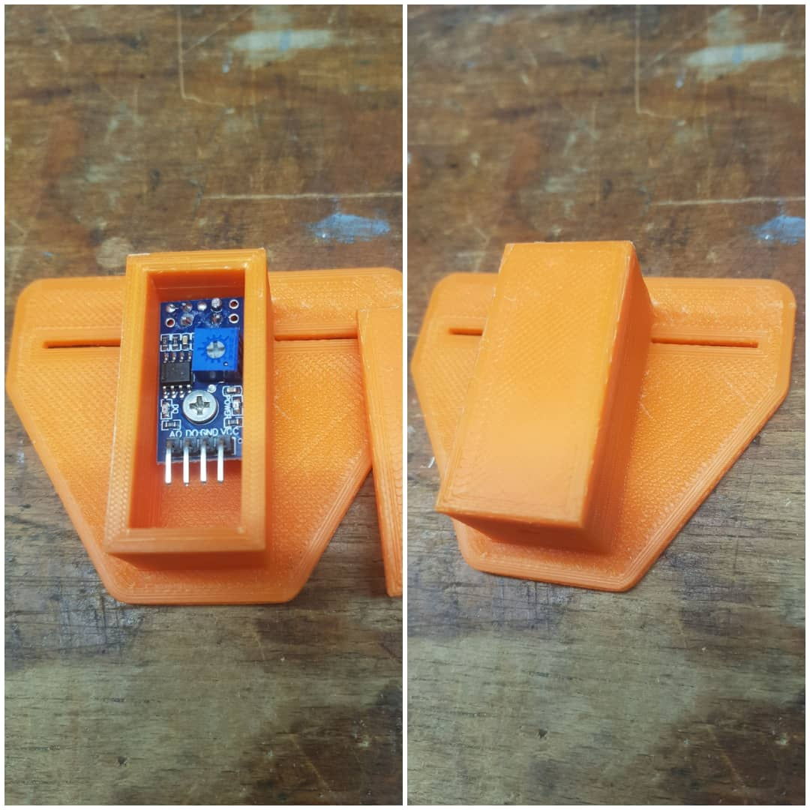

Compile status: 

# Ferraris TCRT5000 ESP8266 Energy Meter Counter MQTT

## Description
This project allows you to count the rounds per KWh of meter disk with the red mark of ferraris energy counter .
The code is tested on ESP8266 platform.
You are able to connect maximum four energy meter.
You can use the cheap TCRT5000 as infrared sensors.
Printable enclosures are available on thingiverse.

## Features
- the code creates a filesystem on flash storage of the esp8266
- all settings are stored on the filesystem in a JSON format
- Wifi-Manager for easy connection to available AccessPoints
- MQTT client to transmit the values to a central server like home-automation-systems
- Webpage to configure all settings or read the values
- OTA Over-The-Air update of firmware

## Steps to get running
1. Install VSCode + PlatformIO
2. Follow the installation guide to compile the framework
https://github.com/maakbaas/esp8266-iot-framework/blob/master/docs/installation-guide.md

## Calibrate sensor
1. Connect the sensor Pin A0 to Pin A0 on the NodeMCU board
2. Open the dashboard and calibrate the sensor by moving up/down - left/right until the best hysteresis
3. Turn the poti left until the light is off, now turn right and stop when the light turn on.

## Using upload ready binary
You are able to upload the compiled binary without Arduino IDE installed. You will find the compiled bin file in binary folder.
The binary supports ESP8266 with 4MB flash e.g. NodeMCU version 2+3.

## Weblinks to get running
- iobroker forum: https://forum.iobroker.net/topic/35404/ferraris-z%C3%A4hler-mit-tcrt5000-und-esp8266
- thingiverse: https://www.thingiverse.com/thing:4560681

## ToDo
- adding floats
- adding gas sensor
- adding impuls settings for S0

## Changelog 

### Ver. 0.92 
  (Eisbaeeer 20211014)
  - Bugfix: Interrupt Routinen bei MQTT Übertragung unterbrochen
  - Bugfix: Interrupt Routinen beim Speichern mit littleFS unterbrochen
  - Dashboard mit zusätzlichen Infos erweitert

### Ver. 0.91 
  (Eisbaeeer 20211011)
  - Graphen zum Dashboard hinzugefügt
  - ISR mit no-delay Entprellung angepasst
  - Nachkommastellen durch fehlerhafte addition von floats entfernt
  - Entprellung ist jetzt konfigurierbar

### Version 0.9 
  (Eisbaeeer 20210917)
  - Graphen zum Dashboard hinzugefügt
  - Analogwert vom Sensor wird jetzt auf dem Dashboard angezeigt
  
### Version 0.8 
  (Eisbaeeer 20210914)
  - Bugfix Zählerroutine - jetzt per Interrupt auf alle Eingänge

### Version 0.7 
  (Eisbaeeer 20210822)
  - Bugfix Zählerstand
  - Zählerstand auf Nachkommastellen erweitert

### Version 0.6
  (Eisbaeeer 20210819)
  - Moved from ArduinoIDE to PlatformIO
  - Merged project to framework

### Version 0.5  
  (Eisbaeeer 20210813)
  - Bugfix boolean
  - Added 3 digits after dot

### Version 0.4
 (Eisbaeeer 20200905)
  - Bugfix Zähler 3 und 4 (Zählerstand)   
  - Neu: MQTT Server Port konfigurierbar    
  - Neu: MQTT publish Zeit einstellbar (1-9999 Sekunden)    
  - Blinken der internen LED aus kompatibilitätsgründen von anderen Boards entfernt (manche Boards nutzen D4 für die interne LED)    
	(ACHTUNG: mit dieser Version gehen die Zählerdaten verloren! bitte über Browser neu eintragen!)   
  - Neu: Port D4 auf D5 umgezogen! (D4 ist bei manchen Boards die interne LED   
  - Neu: Alle Zählerdaten werden im EEPROM abgespeichert.   

### Version 0.3
(Eisbaeeer)   
- adding upload of firmware bin files via webpage (http://.../update)

### Version 0.2
(Eisbaeeer 20200911)   
- fixing debounce to 20ms   

### Version 0.1
(Eisbaeeer 20200803)   
- Initial Version   
- Filesystem to store and read values from   
- Wifi-Manager to connect to Wifi easy   
- Stored values are in JSON format   
- MQTT client to publish values   
- HTTP page for configuration   
- Over the air update of firmware   
- four meter counter (IR-Input pins)   

## License
The MIT License (MIT)
Copyright (c) 2020 Eisbaeeer <eisbaeeer@gmail.com> 
