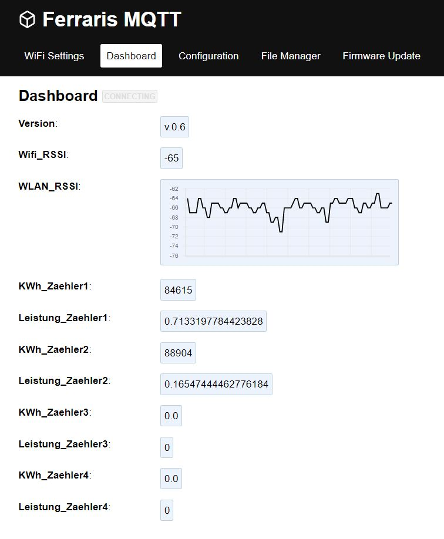

# Ferraris TCRT5000 ESP8266 Energy Meter Counter MQTT

## Description
This project allows you to count the rounds per KWh of meter disk with the red mark of ferraris energy counter .
The code is tested on ESP8266 platform.
You are able to connect maximum four energy meter.
You can use the cheap TCRT5000 as infrared sensors.
Printable enclosures are available on thingiverse.

## Features
- the code creates a filesystem on flash storage of the esp8266
- all settings are stored on the filesystem in a JSON format
- Wifi-Manager for easy connection to available AccessPoints
- MQTT client to transmit the values to a central server like home-automation-systems
- Webpage to configure all settings or read the values
- OTA Over-The-Air update of firmware

## Steps to get running
1. Install Arduino IDE
2. Define board URL: http://arduino.esp8266.com/stable/package_esp8266com_index.json
3. Install board ESP8266
4. Install required libraries: ArduinoJson-5, PubSubClient, WiFiManager
5. Open the source
6. Compile with your board settings

## Weblinks to get running
- iobroker forum: https://forum.iobroker.net/topic/35404/ferraris-z%C3%A4hler-mit-tcrt5000-und-esp8266
- thingiverse: https://www.thingiverse.com/thing:4560681

## ToDo

## Changelog 

### Version 0.5  
  (Eisbaeeer 20210813)
  - Bugfix boolean
  - Added 3 digits after dot

### Version 0.4
 (Eisbaeeer 20200905)
  - Bugfix Zähler 3 und 4 (Zählerstand)   
  - Neu: MQTT Server Port konfigurierbar    
  - Neu: MQTT publish Zeit einstellbar (1-9999 Sekunden)    
  - Blinken der internen LED aus kompatibilitätsgründen von anderen Boards entfernt (manche Boards nutzen D4 für die interne LED)    
	(ACHTUNG: mit dieser Version gehen die Zählerdaten verloren! bitte über Browser neu eintragen!)   
  - Neu: Port D4 auf D5 umgezogen! (D4 ist bei manchen Boards die interne LED   
  - Neu: Alle Zählerdaten werden im EEPROM abgespeichert.   

### Version 0.3
(Eisbaeeer)   
- adding upload of firmware bin files via webpage (http://.../update)

### Version 0.2
(Eisbaeeer 20200911)   
- fixing debounce to 20ms   

### Version 0.1
(Eisbaeeer 20200803)   
- Initial Version   
- Filesystem to store and read values from   
- Wifi-Manager to connect to Wifi easy   
- Stored values are in JSON format   
- MQTT client to publish values   
- HTTP page for configuration   
- Over the air update of firmware   
- four meter counter (IR-Input pins)   

## License
The MIT License (MIT)
Copyright (c) 2020 Eisbaeeer <eisbaeeer@gmail.com> 
